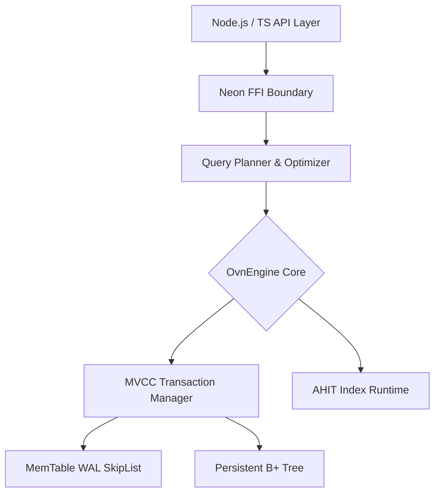

# 🌌 Oblivinx3x 

> **High-Performance Embedded Document Database** — Built in Rust, powered by Node.js. Single file, zero configuration, in-process, pure ACID.

[](https://npm.im/oblivinx3x)
[](https://github.com/natz/oblivinx3x/actions)
[](LICENSE)

Oblivinx3x bridges the gap between massive scale-out databases and simple embedded key-value stores. It gives you the full power of the MongoDB Query Language (MQL) with an advanced Hybrid B+/LSM storage architecture executing right inside your Node.js process.

---

## 📖 For Beginners: Getting Started

### 📦 Installation

```bash
npm install oblivinx3x
```

*Pre-built native binaries are automatically selected for your platform (Windows x64, Linux x64/ARM64, macOS x64/ARM64). **No Rust installation required**!*

### 🚀 Quick Start

Oblivinx3x makes document storage as simple as using an object:

```typescript
import { Oblivinx3x } from 'oblivinx3x';

// 1. Initialize DB (creates file if not exists)
const db = new Oblivinx3x('mydb.ovn', { compression: 'lz4' });

// 2. Access a Collection
const users = db.collection('users');

// 3. Insert and Query Data!
await users.insertOne({ name: 'Alice', role: 'developer' });

const developers = await users.find({ role: 'developer' });
console.log(developers);

// 4. Close database gracefully
await db.close();
```

### ✨ Core Features at a Glance

| Feature | Description |
|---|---|
| **Zero Setup** | Single `.ovn` file stores data, indexes, and logs. No server needed. |
| **MQL Support** | Familiar `$match`, `$group`, `$set`, `$inc`, etc. |
| **ACID Guarantees** | Multi-Version Concurrency (MVCC) means readers never block writers. |
| **TypeScript First** | Fully typed Schemas and Collection logic. |

---

## 🧠 For Experts: Advanced Architecture & Deep Dive

Oblivinx3x is engineered to handle industrial-grade throughput using cutting-edge storage patterns typically found only in enterprise databases.

### 🏗 Architecture Diagram



### 1. Hybrid B+/LSM Storage Engine
- **The Write Path (LSM):** Writes are buffered to an in-memory `MemTable` and securely logged to the Write-Ahead Log (WAL). Data batches periodically flush to Level-0 SSTables, achieving optimal write amplification.
- **The Read Path (B+ Tree):** Background compaction seamlessly merges SSTables into a highly-optimized Persistent B+ Tree to maintain rapid range-scans and point lookups.

### 2. AHIT (Adaptive Hybrid Index Tree)
Oblivinx automatically analyzes access frequencies. Hot index nodes are dynamically promoted to a RAM-based B+ Tree (Hot Zone), while cold nodes stay on disk. 

### 3. Concurrency & Isolation
Fully supports **Snapshot Isolation** via Multi-Version Concurrency Control (MVCC). 
Every document is multi-versioned via a TxID. Readers capture a point-in-time snapshot, eliminating read locks entirely while maintaining transactional integrity.

### 4. Advanced Modules

- **Security & ACL:** Built-in Row-Level Security, Document filtering (`filterDocumentByACL`), Field-Level restrictions, and high-performance Audit Logging.
- **Views & Relations:** Create Materialized Views or define rigorous `defineRelation` dependencies with referential integrity (Cascade/Restrict constraints).
- **Triggers:** Invoke Rust-Native hooks directly on document events for data enrichment before saving.

### 5. DB Pragma Tweaking

You can optimize the Rust storage behaviour strictly out of Node.js:
```typescript
await db.pragma('synchronous', 'normal');  // WAL modes
await db.pragma('buffer_pool_size', '1GB');
```

---

## 🛠 Advanced Usage Examples

### Aggregation Pipeline
Oblivinx3x packs a powerful, MongoDB-like pipeline processor.

```typescript
const stats = await users.aggregate([
  { $match: { active: true } },
  { $lookup: { from: 'orders', localField: '_id', foreignField: 'userId', as: 'userOrders' } },
  { $unwind: '$userOrders' },
  { $group: {
      _id: '$address.country',
      totalSpent: { $sum: '$userOrders.amount' },
      userCount:  { $count: {} }
  }},
  { $sort: { totalSpent: -1 } },
  { $limit: 10 }
]);
```

### ACID Transactions

```typescript
const txn = await db.beginTransaction();
try {
  await txn.update('accounts', { userId: 'alice' }, { $inc: { bal: -100 } });
  await txn.update('accounts', { userId: 'bob' }, { $inc: { bal: 100 } });
  await txn.commit();
} catch (e) {
  await txn.rollback();
}
```

---

## 📄 Documentation

We have curated a detailed documentation website encompassing deep API references, security implementations, and internal details mapping straight into the Rust `crates/`. 

Dive in at: `packages/oblivinx3x/docs/index.html` 

---

*MIT Licensed — Developed for modern high-intensity environments.*
